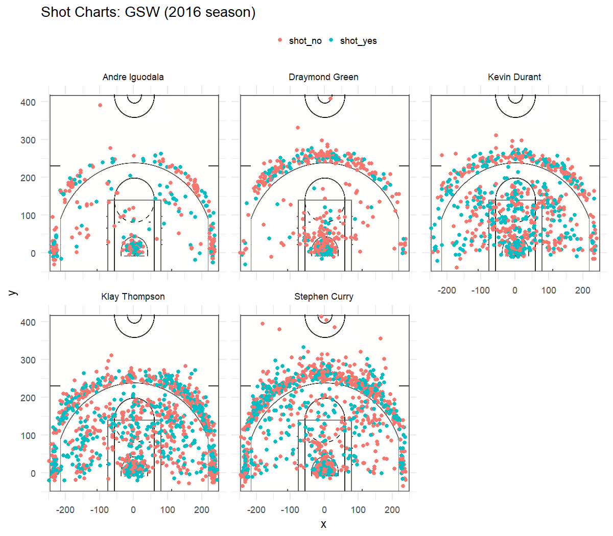

```{r include = FALSE}
library(dplyr)
library(readr)

shots_data <- read_csv("../data/shots-data.csv")
```

# Which Golden State Warrior is the Best at Shooting?

The Golden State Warriors are known for their shooting, but exactly which player can they shoot well from a statistical viewpoint? Is the best shooter in the team the superstar player or just a star player? In this article, five members are going to be measure in the team whom are Andre Iguodala, Draymond Green, Kevin Durant, Klay Thompson, and Stephen Curry to determine which player is the best in the season.


```{r out.width='80%', echo = FALSE, fig.align='center'}

```

Based on the chart above, Thompson and Curry throw the most shots, so it seems that if the players who throw the most shot, then they must be good at shooting. However, that may not be the case when numerical data is involved. Each player will be analyzed in three measurements such as two pointer effective shooting percentage, three pointer effective shooting percentage, and the overall effective shooting percentage. 


## 2PT Effective Shooting % by Player
```{r echo = FALSE, comment = ""}
total2pts <- filter(shots_data, shot_type == "2PT Field Goal")
total2pts <- select(total2pts, name, shot_made_flag, shot_type)

total2pts <- summarise(
  group_by(total2pts, name),
  total = length(shot_type),
  made = length(shot_made_flag[shot_made_flag == "shot_yes"]),
  perc_made = made / total
)

total2pts <- arrange(total2pts, desc(perc_made))
total2pts
```

Based on the table above, there's no doubt that the Warriors are very good at shooting two pointers since each player are near 50 percent or above on making in their shots especially Iguodala with 63.8 percent and Durant with 60.7 percent. Even though Iguodala is ranked first with a higher percentage, Durant dominates this field with a high effective shooting percentage from making most of his shots with his higher attempted shots that are like Curry and Thompson. 

## 3PT Effective Shooting % by Player
```{r echo = FALSE, comment = ""}
total3pts <- filter(shots_data, shot_type == "3PT Field Goal")
total3pts <- select(total3pts, name, shot_made_flag, shot_type)

total3pts <- summarise(
  group_by(total3pts, name),
  total = length(shot_type),
  made = length(shot_made_flag[shot_made_flag == "shot_yes"]),
  perc_made = made / total
)

total3pts <- arrange(total3pts, desc(perc_made))
total3pts
```

The Warriors seem to be weaker at three pointers compared to two pointers since all the players' shooting percentage are below 50 percent of making in their shot. The weakest player in this region is Draymond Green for an effective shooting percentage of 31.9 percent. The biggest difference in pointer type is player Iguodala that he is much weaker in three pointers from ranking first in two pointer effective shooting to the lower ranking in three pointer effective shooting with a 36 percent of making his shot. Looking at the total shots between the total attempts in each point types, he makes more attempts in shooting two pointers than three pointers with a difference of 49 shots (210 - 161). Thompson is the strongest player of three pointers among the players for a decent percentage of shooting three pointers for being the most likely one to make three pointers. So, Thompson would be the one to be considered first for a three pointer in the game when needed. 


## Effective Shooting % by Player
```{r  echo = FALSE, comment = ""}
total_shots <- summarise(
  group_by(shots_data, name),
  total = length(shot_type),
  made = length(shot_made_flag[shot_made_flag == "shot_yes"]),
  perc_made = made / total
)

total_shots <- arrange(total_shots, desc(perc_made))
total_shots
```


For the overall effective shooting percentage, the players are still relatively good because they are still near the 50 percent range especially Kevin Durant and Andre Iguodala as they both are above 50 percent. Durant ranking first is not a big surprise because based on his ranking from the previous two tables are from middle rank to higher rank which shows his constituency in making his shots. Draymond Green seems to be the weakest among the players in overall shooting percentage and seems that he is better off at shooting two pointers than three pointers because his attempts at three pointers bring his overall shooting percentage down since he misses more than he makes. Despite Thompson and Curry not being in the higher ranks in overall effective shooting percentage, their percentage is pretty good based on the total shot attempts that they have which shows that they both get the ball most of the time. They were able to almost make half of their shots which is pretty good for their consistency. Thompson and Curry are very versatile players in two pointers and three pointers 

What makes Kevin Durant stand out the most from the other players is that shooting is the most important aspect in basketball and the player who can make around 50 percent or more overall determines the player's countability to make the shots in the game. It does not matter whether who makes the most attempted shots, but rather who is the most consistent in scoring the points.
